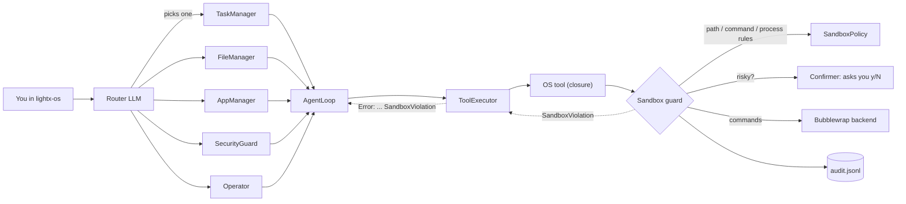

# SmartOS Build Log — How the Sandbox Was Built and Wired Into the Agents

This is a step-by-step record of how SmartOS was added to LightAgentX. Each step says what was done and why, and shows the code it produced. The snippets come from the real files, shortened with `...` where the omitted part adds nothing.

**Contents**

0. [Survey the codebase and find the integration point](#step-0--survey-the-codebase-and-find-the-integration-point)
1. [The policy — what agents may touch](#step-1--the-policy--what-agents-may-touch)
2. [Backends — how commands are isolated](#step-2--backends--how-commands-are-isolated)
3. [The guard — one gatekeeper for every action](#step-3--the-guard--one-gatekeeper-for-every-action)
4. [Smoke-test the isolation on a real machine](#step-4--smoke-test-the-isolation-on-a-real-machine)
5. [Connect the sandbox to agents — the tool-factory pattern](#step-5--connect-the-sandbox-to-agents--the-tool-factory-pattern)
6. [The OS tools](#step-6--the-os-tools)
7. [SmartOS — router plus specialist agents](#step-7--smartos--router-plus-specialist-agents)
8. [The `lightx-os` chat terminal](#step-8--the-lightx-os-chat-terminal)
9. [Packaging](#step-9--packaging)
10. [Tests](#step-10--tests)
11. [Fixes found while testing](#step-11--fixes-found-while-testing)
12. [Branch, commits, and the SmartOS on/off switch](#step-12--branch-commits-and-the-smartos-onoff-switch)
13. [Install testing as a real user](#step-13--install-testing-as-a-real-user)

---

## The big picture



Only two things connect the sandbox to the existing framework:

1. **Every OS tool is a closure that holds a reference to the `Sandbox`.** A tool can't touch the OS without asking the sandbox first.
2. **Refusals are ordinary Python exceptions (`SandboxViolation`).** The existing `ToolExecutor` already turns any exception into an `"Error: ..."` string for the LLM, so the agent loop needed **no changes**.

---

## Step 0 — Survey the codebase and find the integration point

I read every module first. Every tool call in the framework ends up on one line:

```python
# lightagentx/tools/executor.py
try:
    result = tool(**arguments)          # <- runs in-process, with your full user rights
    result_str = str(result) if result is not None else "Done (no output)"
    ...
except Exception as e:
    error_msg = f"Tool '{name}' failed: {type(e).__name__}: {e}"
    return f"Error: {error_msg}"        # <- the LLM sees this text
```

What that tells us:

- The `except Exception` branch is already a feedback channel to the LLM. If a tool raises a well-named exception with a clear message, the agent learns **why** it was stopped, and nothing crashes.
- Hooks **can't** be used for security. `HookRegistry.emit` swallows every exception and ignores return values, so a `before_tool_call` hook can't block anything:

```python
# lightagentx/hooks.py
for callback in self._hooks[event_name]:
    try:
        callback(event)
    except Exception:
        pass  # hooks must never crash the agent
```

**Decision:** enforce security **inside the tools** through a shared `Sandbox` object, and use hooks only for display (showing tool calls in the terminal).

---

## Step 1 — The policy — what agents may touch

**File:** `lightagentx/sandbox/policy.py`

All the rules live in one plain dataclass, so they're easy to read, change and save.

### 1a. Risk levels

```python
class Risk(enum.IntEnum):
    LOW = 1      # read-only (list files, show processes, scan ports)
    MEDIUM = 2   # reversible or contained (write in workspace, isolated command)
    HIGH = 3     # destructive or outside the sandbox (kill, delete, unisolated command)
```

`IntEnum` lets a single comparison decide whether to ask the human: `risk >= policy.confirm_at`.

### 1b. Secrets that are always denied

```python
def _default_deny_paths() -> list[Path]:
    """Secrets and credential stores agents must never read or write."""
    home = _home()
    rel = [
        ".ssh", ".gnupg", ".aws", ".azure", ".kube", ".docker",
        ".config/gcloud", ".config/gh", ".netrc", ".pgpass", ".git-credentials",
        ".password-store", ".local/share/keyrings", ".pki",
        ".mozilla", ".config/google-chrome", ".config/chromium",
        ".config/BraveSoftware", ".lightx/audit.jsonl",
    ]
    ...

_DEFAULT_DENY_GLOBS = [
    "*.pem", "*.key", "*.p12", "*.pfx", "id_rsa*", "id_ed25519*", "id_ecdsa*",
    ".env", ".env.*", "*.kdbx",
]
```

The audit log is on the deny list too, so an agent can't read or edit the record of what it did.

### 1c. Blocked commands (a second layer on top of isolation)

```python
_DEFAULT_BLOCKED_COMMANDS = [
    r"\brm\s+(-[a-zA-Z]*\s+)*-[a-zA-Z]*[rR][a-zA-Z]*\s+(-[a-zA-Z]*\s+)*(/|~|\$HOME)\s*($|[;&|])",
    r"\bmkfs(\.\w+)?\b",
    r"\bdd\b.*\bof=/dev/",
    r"\b(shutdown|reboot|poweroff|halt|init\s+[06])\b",
    r"\bsudo\b|\bsu\s|\bdoas\b|\bpkexec\b",
    r":\(\)\s*\{\s*:\|:&\s*\};:",                     # fork bomb
    r"\bchmod\s+(-R\s+)?[0-7]*777\s+/",
    r">\s*/dev/sd[a-z]",
    r"\b(curl|wget)\b[^|]*\|\s*(ba|z|)sh\b",          # curl | sh
]
```

These regexes are **not** the security boundary, since they can be dodged with clever quoting. The isolation in Step 2 is. They exist to refuse obviously destructive commands early, with a clear message.

### 1d. The policy dataclass and its checks

```python
@dataclass
class SandboxPolicy:
    workspace: Path = field(default_factory=lambda: _home() / ".lightx" / "workspace")
    read_paths: list[Path] = field(default_factory=lambda: [_home()])
    write_paths: list[Path] = field(default_factory=list)
    deny_paths: list[Path] = field(default_factory=_default_deny_paths)
    deny_globs: list[str] = field(default_factory=lambda: list(_DEFAULT_DENY_GLOBS))
    allow_network: bool = False
    timeout_s: float = 30.0
    memory_mb: int = 1024
    max_output_chars: int = 20_000
    blocked_commands: list[str] = ...
    protected_processes: list[str] = ...   # systemd, sshd, Xorg, gnome-shell, ...
    trusted_apps: list[str] = field(default_factory=list)
    confirm_at: Risk = Risk.HIGH

    def __post_init__(self) -> None:
        self.workspace = Path(self.workspace).expanduser().resolve()
        ...
        if self.workspace not in self.write_paths:
            self.write_paths.insert(0, self.workspace)   # workspace is always writable

    def is_denied(self, path: Path) -> bool:
        for denied in self.deny_paths:
            if path == denied or denied in path.parents:
                return True
        return any(path.match(g) for g in self.deny_globs)

    def can_read(self, path: Path) -> bool:
        return not self.is_denied(path) and _under_any(path, self.read_paths)

    def can_write(self, path: Path) -> bool:
        return not self.is_denied(path) and _under_any(path, self.write_paths)
```

Deny always beats allow. Every path is `.resolve()`d first, so `../` tricks and symlinks are expanded **before** the check (a test covers this).

`to_dict()` / `from_dict()` make the policy serializable, so it can later be saved alongside agent snapshots.

---

## Step 2 — Backends — how commands are isolated

**File:** `lightagentx/sandbox/backends.py`

A backend's job is to run a command with limits. There are two: one that works everywhere, and one that actually isolates on Linux.

### 2a. A uniform result object

```python
@dataclass
class ExecResult:
    stdout: str
    stderr: str
    exit_code: int
    timed_out: bool = False
    duration_s: float = 0.0

    def to_text(self, max_chars: int = 20_000) -> str:
        """Compact text form for handing back to an LLM."""
```

### 2b. Scrubbed environment — API keys never reach commands

```python
_SAFE_ENV_VARS = ("PATH", "LANG", "LC_ALL", "LC_CTYPE", "TERM", "USER", "LOGNAME", "TZ")

def _safe_env(policy: SandboxPolicy) -> dict[str, str]:
    env = {k: os.environ[k] for k in _SAFE_ENV_VARS if k in os.environ}
    env["HOME"] = str(policy.workspace)
    env["LIGHTX_SANDBOX"] = "1"
    return env
```

This uses an allowlist, not a blocklist, so new secret variables can't leak in by accident.

### 2c. Resource limits (POSIX)

```python
def _rlimit_preexec(policy: SandboxPolicy):
    import resource
    mem = policy.memory_mb * 1024 * 1024
    cpu = int(policy.timeout_s) + 5

    def apply() -> None:
        for limit, value in (
            (resource.RLIMIT_AS, mem),                    # memory
            (resource.RLIMIT_CPU, cpu),                   # CPU seconds
            (resource.RLIMIT_FSIZE, 512 * 1024 * 1024),   # max file size
            (resource.RLIMIT_CORE, 0),                    # no core dumps
        ):
            resource.setrlimit(limit, (value, value))
    return apply
```

### 2d. The shared run loop — timeout kills the whole process group

```python
class SandboxBackend(ABC):
    name: str = "base"
    isolated: bool = False          # <- drives the risk level of commands

    @abstractmethod
    def build_argv(self, argv: list[str], policy: SandboxPolicy) -> list[str]: ...

    def run(self, argv, policy, stdin=None, timeout_s=None) -> ExecResult:
        timeout = min(timeout_s or policy.timeout_s, policy.timeout_s)   # LLM can't raise the cap
        proc = subprocess.Popen(
            self.build_argv(argv, policy),
            cwd=str(policy.workspace),
            env=_safe_env(policy),
            preexec_fn=_rlimit_preexec(policy),
            start_new_session=(os.name == "posix"),       # own process group
            ...
        )
        try:
            out, err = proc.communicate(..., timeout=timeout)
        except subprocess.TimeoutExpired:
            timed_out = True
            _kill_tree(proc)                               # os.killpg(..., SIGKILL)
            out, err = proc.communicate()
```

### 2e. `SubprocessBackend` — runs anywhere, isolates nothing

```python
class SubprocessBackend(SandboxBackend):
    name = "subprocess"
    isolated = False

    def build_argv(self, argv, policy):
        return list(argv)
```

Because `isolated = False`, the guard (Step 3) treats **every** command as HIGH risk, so you approve each one.

### 2f. `BubblewrapBackend` — real isolation on Linux, without root

Bubblewrap (`bwrap`) uses Linux namespaces, the same kernel feature containers use. The command is wrapped in a stack of mounts, and **order matters**: later mounts cover earlier ones.

```python
def build_argv(self, argv, policy):
    home = Path.home().resolve()
    ws = str(policy.workspace)
    args = [
        "bwrap",
        "--die-with-parent",          # sandbox dies if LightX dies
        "--new-session",              # can't inject keystrokes into your terminal
        "--unshare-all",              # private net, PID, IPC, UTS, user, cgroup namespaces
        "--hostname", "lightx-sandbox",
        "--ro-bind", "/", "/",        # 1. whole system, READ-ONLY
        "--dev", "/dev",
        "--proc", "/proc",            #    /proc shows only sandbox processes
        "--tmpfs", "/tmp",            # 2. private /tmp  (hides X11 sockets)
        "--tmpfs", "/run",            #    private /run  (hides D-Bus / Wayland / systemd)
        "--tmpfs", str(home),         # 3. EMPTY home directory ...
    ]
    if policy.allow_network:
        args += ["--share-net"]
        args += ["--ro-bind-try", "/run/systemd/resolve", "/run/systemd/resolve"]  # DNS

    for p in policy.read_paths:       # 4. ... re-add allowed home paths, read-only
        if p == home or home in p.parents:
            args += ["--ro-bind-try", str(p), str(p)]

    for p in policy.deny_paths:       # 5. hide secrets on top of that
        if p.is_dir():
            args += ["--tmpfs", str(p)]
        elif p.exists():
            args += ["--ro-bind", "/dev/null", str(p)]

    args += ["--bind", ws, ws, "--chdir", ws, "--"]   # 6. workspace is the ONLY writable place
    return args + list(argv)
```

Why each layer is there:

| Layer | Blocks |
|---|---|
| `--ro-bind / /` | Modifying system files, installing anything |
| `--tmpfs /run` | `systemctl --user`, `gdbus`, `notify-send` → reaching the desktop through D-Bus |
| `--tmpfs /tmp` | Reaching your X11 display and other programs' temp files |
| `--unshare-all` without `--share-net` | All network, including data exfiltration |
| `--unshare-all` (PID namespace) | Seeing or signalling your real processes |
| `--tmpfs ~/.ssh` etc. | Reading keys even when `~` is readable |
| `--die-with-parent` | Orphaned sandbox processes |

### 2g. Detect and auto-select

```python
@classmethod
def available(cls) -> bool:
    # Actually try it once — some distros disable unprivileged user namespaces.
    r = subprocess.run(["bwrap", "--ro-bind", "/", "/", "--unshare-all", "true"], ...)
    cls._available = r.returncode == 0

def auto_backend() -> SandboxBackend:
    if BubblewrapBackend.available():
        return BubblewrapBackend()
    return SubprocessBackend()
```

---

## Step 3 — The guard — one gatekeeper for every action

**File:** `lightagentx/sandbox/guard.py`

`Sandbox` combines four things: **policy + backend + confirmer + audit log**. Every OS tool calls into it.

### 3a. The exception that carries refusals back to the LLM

```python
class SandboxViolation(PermissionError):
    """Raised when an action is outside the policy or the human declines it.

    The ToolExecutor turns this into an error string the LLM can read, so the
    agent learns *why* it was stopped instead of crashing.
    """
```

### 3b. Confirmers — the default is "no"

```python
Confirmer = Callable[[str, Risk], bool]

def deny_all(description: str, risk: Risk) -> bool:
    """Default confirmer: no human attached, so nothing risky runs."""
    return False
```

If you use the library without attaching a human (a script, Colab, a server), risky actions are **refused**, not silently allowed.

### 3c. The `Sandbox` class

```python
@dataclass
class Sandbox:
    policy: SandboxPolicy = field(default_factory=SandboxPolicy)
    backend: SandboxBackend = field(default_factory=auto_backend)
    confirmer: Confirmer = deny_all
    audit_file: Path | None = None
    audit_log: list[AuditEntry] = field(default_factory=list)

    def resolve(self, path):
        """Relative paths are relative to the workspace."""
        p = Path(os.path.expandvars(str(path))).expanduser()
        if not p.is_absolute():
            p = self.policy.workspace / p
        return p.resolve()

    def check_read(self, path) -> Path:
        p = self.resolve(path)
        if not self.policy.can_read(p):
            self._record("read", str(p), Risk.LOW, "blocked")
            raise SandboxViolation(f"Read access to '{p}' is not allowed by the sandbox policy.")
        return p
```

### 3d. `authorize()` — the decision point

```python
def authorize(self, action: str, target: str, risk: Risk, detail: str = "") -> None:
    if self.policy.needs_confirmation(risk):
        description = f"{action}: {target}" + (f"\n    {detail}" if detail else "")
        if not self.confirmer(description, risk):
            self._record(action, target, risk, "declined", detail)
            raise SandboxViolation(
                f"The user declined '{action}' on '{target}'. "
                f"Do not retry; ask the user how they want to proceed."
            )
        self._record(action, target, risk, "approved", detail)
    else:
        self._record(action, target, risk, "allowed", detail)
```

The error message tells the LLM what to do next ("Do not retry; ask the user"), which steers its behaviour.

### 3e. Commands: risk depends on whether the backend isolates

```python
@property
def command_risk(self) -> Risk:
    return Risk.MEDIUM if self.backend.isolated else Risk.HIGH

def run_shell(self, command: str, timeout_s=None) -> ExecResult:
    reason = self.policy.blocked_command_reason(command)
    if reason:                                   # blocked commands never even reach the human
        self._record("run_command", command, Risk.HIGH, "blocked", reason)
        raise SandboxViolation(f"Command blocked by policy (matched {reason!r}).")

    self.authorize("run_command", command, self.command_risk, f"backend={self.backend.name}")
    argv = ["/bin/sh", "-c", command] if os.name == "posix" else ["cmd", "/c", command]
    return self.backend.run(argv, self.policy, timeout_s=timeout_s)
```

### 3f. Audit trail

```python
def _record(self, action, target, risk, decision, detail=""):
    entry = AuditEntry(time.time(), action, target[:500], risk.name, decision, detail[:500])
    self.audit_log.append(entry)
    if self.audit_file is not None:
        with self.audit_file.open("a", encoding="utf-8") as f:
            f.write(json.dumps(asdict(entry)) + "\n")
```

Every decision (`allowed`, `approved`, `declined`, `blocked`) is recorded in memory and in `~/.lightx/audit.jsonl`.

---

## Step 4 — Smoke-test the isolation on a real machine

Before building anything on top, I checked that the isolation actually holds on Fedora 42:

```python
s = Sandbox(policy=SandboxPolicy(workspace=ws))
for c in ['id -un; hostname; pwd', 'touch /home/devansh/x', 'echo hi > ok.txt && cat ok.txt',
          'curl -sS -m 3 https://example.com', 'ls /run/user', 'env | grep -i key', 'ps aux | wc -l']:
    print(s.run_shell(c).to_text())
```

| Command | Result | Proves |
|---|---|---|
| `hostname` | `lightx-sandbox` | own UTS namespace |
| `touch ~/x` | `Read-only file system` | home is read-only |
| `echo hi > ok.txt` | works | workspace is writable |
| `curl example.com` | `Could not resolve host` | no network |
| `ls /run/user` | `No such file` | D-Bus/Wayland unreachable |
| `env \| grep key` | nothing | API keys stripped |
| `ps aux \| wc -l` | `5` | own PID namespace |
| `sudo ls` | `Command blocked by policy` | blocklist works |

---

## Step 5 — Connect the sandbox to agents — the tool-factory pattern

This is the step that wires everything together.

The framework's `@tool` decorator turns a function into a `BaseTool` by reading its name, docstring and type hints. Tools need access to the sandbox, but the LLM must **never** see or control it. A global would be fragile, and a `sandbox` parameter would end up in the JSON schema the LLM sees.

**Solution: a factory function that defines tools as closures.**

```python
def make_file_tools(sandbox: Sandbox) -> list[BaseTool]:
    """Build file-management tools bound to a sandbox."""

    @tool
    def read_file(path: str, max_chars: int = 20000) -> str:
        """Read a text file.

        Args:
            path: File to read.
            max_chars: Maximum characters to return.
        """
        p = sandbox.check_read(path)          # <- captured from the enclosing scope
        ...

    return [list_directory, read_file, write_file, ...]
```

What this achieves:

- The LLM sees the schema `read_file(path: string, max_chars: integer)`. The `sandbox` is invisible to it.
- Each `Sandbox` gets its own set of tools, so two agents can have different policies.
- **No framework code changed.** `SingleAgent`, `AgentLoop`, `ToolRegistry` and `ToolExecutor` treat these as ordinary tools.

**Full path of a refusal**, with no new plumbing:

```
LLM: terminate_process(pid=1)
  -> ToolExecutor.execute  ->  tool(**arguments)
     -> terminate_pid(...)  ->  raise sandbox.violation(...)       # SandboxViolation
  <- except Exception as e: return "Error: Tool 'terminate_process' failed:
                                     SandboxViolation: PID 1 (systemd) is part of the system..."
  -> AgentLoop adds it as a tool message -> LLM explains to the user
```

A test (`test_violation_reaches_llm_as_error`) checks that exactly this text reaches the LLM.

---

## Step 6 — The OS tools

All tools follow the same recipe: **check the path or target → `authorize()` with a risk level → act → return short text.**

### 6a. Files — `lightagentx/smartos/files.py`

Writes are graded by **where** they land:

```python
@tool
def write_file(path: str, content: str, append: bool = False) -> str:
    p = sandbox.check_write(path)
    risk = Risk.LOW if sandbox.in_workspace(p) else Risk.MEDIUM
    if p.exists() and not append and not sandbox.in_workspace(p):
        risk = Risk.HIGH                       # overwriting your real file -> ask
    sandbox.authorize("write_file", str(p), risk, ...)
```

Deletion is recoverable. Files are moved to a timestamped trash folder instead of being unlinked:

```python
@tool
def move_to_trash(path: str) -> str:
    p = sandbox.check_write(path)
    if p in sandbox.policy.write_paths:
        raise sandbox.violation("delete", str(p), "Refusing to delete a sandbox root directory.")
    sandbox.authorize("delete", str(p), Risk.HIGH, "moved to ~/.lightx/trash (recoverable)")
    trash = Path.home() / ".lightx" / "trash" / datetime.now().strftime("%Y%m%d-%H%M%S")
    shutil.move(str(p), str(trash / p.name))
```

Opening a file goes through the desktop (`xdg-open` / `open` / `os.startfile`), which can **run** launchers and scripts, so those count as HIGH:

```python
runnable = p.is_file() and (
    os.access(p, os.X_OK) or p.suffix.lower() in _RUNNABLE_SUFFIXES   # .desktop, .sh, .exe, ...
)
sandbox.authorize("open_file", str(p), Risk.HIGH if runnable else Risk.MEDIUM)
```

Directory listings and searches skip denied files, so the agent never even learns that `server.pem` exists.

### 6b. Task manager — `lightagentx/smartos/tasks.py` (uses `psutil`)

CPU percentages need two samples, so the code samples twice, 0.3 s apart:

```python
for p in psutil.process_iter(["pid", "name", "username"]):
    p.cpu_percent(None)             # first sample primes the counter
    procs.append(p)
time.sleep(0.3)
... p.cpu_percent(None) ...         # second sample is meaningful
```

Terminating a process goes through five checks before you're asked:

```python
def terminate_pid(sandbox: Sandbox, pid: int, force: bool = False) -> str:
    ...
    except psutil.AccessDenied:
        raise sandbox.violation("terminate", f"PID {pid}", f"PID {pid} belongs to another user; not allowed.")

    if pid <= 1 or pid in _own_lineage():                      # init, LightX, its terminal
        raise sandbox.violation(...)
    if sandbox.policy.is_protected_process(name):              # systemd, sshd, gnome-shell...
        raise sandbox.violation(...)
    if me and user != me:                                      # only your own processes
        raise sandbox.violation(...)

    sandbox.authorize("kill" if force else "terminate",
                      f"PID {pid} ({name})", Risk.HIGH, cmdline)  # you see the full command line
    proc.kill() if force else proc.terminate()
    proc.wait(timeout=5)
```

`_own_lineage()` protects LightX's own process **and all its parents**, so the agent can't kill the terminal you're chatting from. `terminate_pid` is a plain function, not a tool, so the `/kill` CLI command and the `close_application` tool reuse exactly the same checks.

### 6c. Apps — `lightagentx/smartos/apps.py`

Apps are discovered from freedesktop `.desktop` files (or `/Applications` on macOS). The agent can **only** launch apps that are actually installed, never an arbitrary binary path:

```python
def discover_apps(dirs=None) -> dict[str, AppEntry]:
    for d in dirs if dirs is not None else _desktop_dirs():
        for f in sorted(d.glob("*.desktop")):
            cp = configparser.RawConfigParser(strict=False, interpolation=None)
            cp.read(f, encoding="utf-8")
            e = cp["Desktop Entry"]
            if e.get("NoDisplay", "false").lower() == "true": continue
            ...

def _launch(app: AppEntry) -> None:
    if shutil.which("gtk-launch") and app.source.endswith(".desktop"):
        cmd = ["gtk-launch", app.app_id]
    else:
        # Strip desktop-entry field codes (%f %U ...) — we never pass arguments.
        cmd = [t for t in shlex.split(app.exec_cmd) if not (t.startswith("%") and len(t) == 2)]
```

`close_application` finds your processes by name, signals only the top-level ones (child processes exit with their parent), and sends each through `terminate_pid`.

### 6d. Security — `lightagentx/smartos/security.py`

All checks are read-only (LOW risk). System queries use **fixed** arguments and never take LLM input:

```python
def _cmd(argv: list[str]) -> str | None:
    """Run a fixed, trusted read-only system query. Never takes LLM input."""

def suspicious_processes() -> list[str]:
    for p in psutil.process_iter(["pid", "name", "exe", "username"]):
        exe = p.info.get("exe") or ""
        if exe.startswith(("/tmp/", "/dev/shm/", "/var/tmp/", "/run/user/")):
            findings.append(f"... runs from temp dir: {exe}")
        elif exe.endswith(" (deleted)"):
            findings.append(f"... binary was deleted after start: {exe}")
```

`security_scan` combines: firewall (firewalld/ufw/nft/macOS/Windows), SELinux/AppArmor, listening ports (flagged `EXPOSED` on `0.0.0.0`/`::`), suspicious processes, credential **permissions** (via `stat`, never reading the contents), and autostart entries (autostart folders, `systemd --user` units, crontab), which are the usual places malware sets itself up to run again.

### 6e. Shell — `lightagentx/smartos/shell.py`

```python
@tool
def run_python(code: str) -> str:
    """Run a Python snippet inside the sandbox and return what it prints."""
    script = sandbox.policy.workspace / f".run_{uuid.uuid4().hex[:8]}.py"
    sandbox.authorize("run_python", f"{len(code)} chars of code", sandbox.command_risk, code[:300])
    script.write_text(code, encoding="utf-8")
    try:
        result = sandbox.run_argv([python, "-I", script.name])   # -I: isolated mode
    finally:
        script.unlink(missing_ok=True)
```

This is the safe replacement for the `eval()` calculators in the older examples.

---

## Step 7 — SmartOS — router plus specialist agents

**File:** `lightagentx/smartos/os_agent.py`

### 7a. Group tools per specialist

```python
def build_os_tools(sandbox: Sandbox) -> dict[str, list[BaseTool]]:
    files = {t.name: t for t in make_file_tools(sandbox)}
    tasks = {t.name: t for t in make_task_tools(sandbox)}
    ...
    return {
        "FileManager":   list(files.values()),
        "TaskManager":   list(tasks.values()),
        "AppManager":    list(apps.values()) + [files["open_file"], files["search_files"]],
        "SecurityGuard": list(sec.values()) + [tasks["list_processes"], tasks["process_details"],
                                               tasks["terminate_process"], files["file_info"]],
        "Operator":      list(shell.values()) + [files["list_directory"], files["read_file"],
                                                 files["write_file"]],
    }
```

All tools are built from **one** `sandbox`, so every specialist shares the same policy, confirmer and audit log.

### 7b. Each specialist is a plain `SingleAgent`

```python
def _make_agent(self, name, description, duty, tools) -> SingleAgent:
    prompt = _BASE_PROMPT.format(
        role=f"the {name} agent", os_name=f"{platform.system()} {platform.release()}",
        duty=duty, sandbox=self.sandbox.describe(),       # the agent knows its own limits
    )
    return SingleAgent(
        name=name, llm=self.llm, tools=tools, memory=BufferMemory(max_messages=40),
        system_prompt=prompt, description=description,
        max_iterations=self.max_iterations, verbose=self.verbose,
        hooks=self.hooks,                                 # shared hooks -> one trace display
    )
```

The system prompt tells every agent how to behave when refused:

```
- If a tool returns an error mentioning the sandbox, policy, or that the user declined,
  do NOT work around it with other commands, paths or tools. Explain and stop.
```

The prompt is only guidance. The sandbox still enforces the rules, but the prompt saves wasted attempts.

### 7c. The router

The existing `CrewAgent` always runs a synthesis LLM call, and if planning fails it **broadcasts the task to every agent**. For an OS that would be slow, and dangerous (five agents acting on "kill it"). So SmartOS has its own router:

```python
def route(self, message: str) -> list[dict[str, str]]:
    if self.mode == "single":
        return [{"agent": "Generalist", "task": message}]
    history = "\n".join(f"User: {u}\nSmartOS: {a[:400]}"
                        for u, a in self._history[-self.history_turns:]) or "(none)"
    response = self.llm.chat([
        {"role": "system", "content": _ROUTER_PROMPT.format(agents=agents, history=history)},
        {"role": "user", "content": message},
    ])
    plan = _parse_plan(response.content)
    valid = [d for d in plan if d.get("agent") in self.specialists or d.get("agent") == "Generalist"]
    if not valid:
        return [{"agent": "Generalist", "task": message}]      # safe fallback: ONE agent
    return valid
```

The router prompt asks it to make each task **self-contained**. "Kill it" becomes "terminate PID 145395 (java)", using the recent conversation.

### 7d. Running

```python
def run(self, input_text: str) -> str:
    plan = self.route(input_text)
    self.hooks.emit("on_route", plan=plan)                 # CLI shows "↳ TaskManager"
    if len(plan) == 1:
        answer = self._agent(plan[0]["agent"]).run(plan[0].get("task") or input_text)
    else:
        ...  # run each, then one LLM call to merge the reports
    self._history.append((input_text, answer))
```

With a single delegation (the common case) there's no synthesis call, so a request costs one routing call plus the specialist's tool loop.

---

## Step 8 — The `lightx-os` chat terminal

**File:** `lightagentx/smartos/cli.py`

### 8a. The human confirmer

```python
def terminal_confirmer(description: str, risk: Risk) -> bool:
    if not sys.stdin.isatty():
        return False                   # piped/non-interactive -> always decline
    color = _C["red"] if risk >= Risk.HIGH else _C["yellow"]
    print(f"\n{color}{_C['bold']}⚠ {risk.name} RISK{_C['reset']}  {description}")
    answer = input(f"{color}Allow? [y/N] {_C['reset']}").strip().lower()
    return answer in ("y", "yes")
```

### 8b. Showing what the agents do, using hooks

```python
@hooks.on("on_route")
def _route(e): print(f"  ↳ {names}")

@hooks.on("before_tool_call")
def _tool(e): print(f"  · {e.data['tool_name']}({args})")
```

### 8c. Building the sandbox from flags

```python
policy = SandboxPolicy(
    workspace=...,
    write_paths=[Path(p) for p in args.allow_write],    # --allow-write ~/Documents
    allow_network=args.network,                          # --network
    confirm_at=Risk[args.confirm.upper()],               # --confirm low|medium|high
    trusted_apps=args.trust_app,                         # --trust-app firefox
)
backend = SubprocessBackend() if args.no_isolation else auto_backend()
return Sandbox(policy=policy, backend=backend, confirmer=terminal_confirmer,
               audit_file=Path.home() / ".lightx" / "audit.jsonl")
```

### 8d. Choosing an LLM — including fully local

```python
if provider == "auto":
    if base_url:                                   provider = "openai"   # Ollama, vLLM...
    elif os.environ.get("ANTHROPIC_API_KEY"):      provider = "anthropic"
    elif os.environ.get("OPENAI_API_KEY"):         provider = "openai"
    elif os.environ.get("GOOGLE_API_KEY"):         provider = "gemini"
```

### 8e. Direct commands (no LLM)

`/stats`, `/ps [cpu|memory] [N]`, `/kill PID`, `/scan`, `/apps [q]`, `/policy`, `/audit [N]`, `/reset`, `/help`, `/exit`. They call the same functions the tools use (for example `/kill` → `terminate_pid`), so the same rules apply.

---

## Step 9 — Packaging

`pyproject.toml` (and `setup.py`, kept in sync):

```toml
[project.optional-dependencies]
os  = ["psutil>=5.9.0"]
all = ["anthropic>=0.30.0", "google-genai>=1.0.0", "psutil>=5.9.0"]

[project.scripts]
lightx-os = "lightagentx.smartos.cli:main"
```

`lightagentx/__init__.py` exports only the **stdlib-only** sandbox types:

```python
from .sandbox import Risk, Sandbox, SandboxPolicy, SandboxViolation
```

`lightagentx.smartos` is **not** imported automatically. Verified: `import lightagentx` doesn't load psutil, creates no files, and the sandbox adds about 5 ms of import time, so users who just explore the library in Colab or an IDE see no difference.

`python -m lightagentx.smartos` works too, via `lightagentx/smartos/__main__.py`. I built the wheel and checked that it contains both packages and the `lightx-os` entry point.

---

## Step 10 — Tests

56 new tests (191 total), none of which need an API key.

**`tests/test_sandbox.py`**: policy, guard and backends:

```python
def test_symlink_escape_blocked(self, ws, tmp_path):
    s = make(ws)
    outside = tmp_path / "outside"; outside.mkdir()
    (s.policy.workspace / "link").symlink_to(outside)
    with pytest.raises(SandboxViolation):
        s.check_write("link/evil.txt")

def test_runs_in_workspace_with_scrubbed_env(self, ws, monkeypatch):
    monkeypatch.setenv("OPENAI_API_KEY", "sk-secret")
    r = make(ws, confirmer=allow_all).run_shell("pwd; echo key=$OPENAI_API_KEY")
    assert "sk-secret" not in r.stdout

@pytest.mark.skipif(not BubblewrapBackend.available(), reason="bubblewrap not usable here")
class TestBubblewrapBackend:
    def test_no_network_by_default(self, sb):
        code = ("import socket\ntry:\n socket.create_connection(('1.1.1.1', 53), timeout=2)\n"
                " print('CONNECTED')\nexcept OSError as e:\n print('BLOCKED', e)")
        assert "BLOCKED" in sb.run_argv(["python3", "-c", code]).stdout
```

**`tests/test_smartos.py`**: tools on real processes, plus routing with a scripted LLM:

```python
def test_terminate_requires_confirmation(self, sandbox):
    sandbox.confirmer = deny_all
    proc = subprocess.Popen([sys.executable, "-c", "import time; time.sleep(60)"])
    with pytest.raises(SandboxViolation, match="declined"):
        terminate_pid(sandbox, proc.pid)
    assert proc.poll() is None                      # still running

def test_violation_reaches_llm_as_error(self, sandbox):
    ...  # router -> TaskManager -> terminate_process(pid=1)
    tool_msg = [m for m in llm.requests[-1] if m["role"] == "tool"][-1]
    assert "SandboxViolation" in tool_msg["content"]
```

Bubblewrap tests skip automatically where `bwrap` isn't available, and SmartOS tests skip without psutil, so CI on macOS or Windows still passes.

---

## Step 11 — Fixes found while testing

| Found | Fix |
|---|---|
| `OpenAILLM(base_url=...)` rejected any key not shaped like `sk-...`, so Ollama and other local servers failed | Only check the key format when talking to OpenAI itself (`provider=None if base_url else "openai"`), committed separately |
| `/kill 1` was refused but didn't show up in `/audit` | Added `Sandbox.violation()`, which records `blocked` and returns the exception, and used it everywhere a rule refuses |
| `xdg-open` on a `.desktop` file or a script **executes** it | `open_file` is HIGH risk for executables and launcher/script extensions |
| CLI defaulted to confirming MEDIUM risk, so every isolated `ls` asked for approval | Default `--confirm high`, so prompts appear only for things that matter and you actually read them |
| The first no-network test read `/sys/class/net`, which shows the **host's** network interfaces | The test now tries a real TCP connection |

Live check of the tools on this machine: SELinux enforcing, firewalld running, one service open to the network (LLMNR on port 5355), no suspicious processes, credential file permissions OK.

---

## Step 12 — Branch, commits, and the SmartOS on/off switch

```
pre-smartos (tag)  ec7b44a  main before any of this
feature/smartos    ├─ fix(llm): accept non-OpenAI key formats when base_url is set
                   ├─ feat: add sandbox and SmartOS agent layer
                   └─ feat: SmartOS on/off switch + install fixes
```

The key fix is a separate commit because it's useful on its own.

### Why a switch instead of deleting code

The goal is to drop back to "LightAgentX as a simple agent manager" **without** losing SmartOS. A first version used a git-revert script. It was replaced by a runtime switch, because users who `pip install` the library don't have a git repo, and turning SmartOS back on should take one command.

### `lightagentx/features.py`

The setting is resolved in a fixed order, so it's always clear which source decided:

```python
def smartos_status() -> dict[str, Any]:
    env = os.environ.get(SMARTOS_ENV, "").strip().lower()        # 1. LIGHTAGENTX_SMARTOS
    if env in _TRUE or env in _FALSE:
        return {"enabled": env in _TRUE, "source": f"env {SMARTOS_ENV}={env}", ...}
    cfg = _load()                                                 # 2. ~/.lightx/config.json
    if isinstance(cfg.get("smartos"), bool):
        return {"enabled": cfg["smartos"], "source": "config file", ...}
    return {"enabled": True, "source": "default", ...}            # 3. default: on
```

`disable_smartos()` / `enable_smartos()` write the config file and keep any other keys. If an environment variable overrides what was just saved, they say so.

### Enforced in three places

```python
# 1. lightagentx/smartos/__init__.py — the package refuses to import
from ..features import require_smartos
require_smartos()  # switched off -> SmartOSDisabledError

# 2. SmartOS.__init__ — catches switching off at runtime, after the import
require_smartos()

# 3. the lightx-os command now starts here (pyproject: lightx-os = "lightagentx.features:launch_smartos")
def launch_smartos(argv=None) -> int:
    if "--enable" in args:  print(enable_smartos());  return 0
    if "--disable" in args: print(disable_smartos()); return 0
    if "--status" in args:  ...;                       return 0
    try:
        require_smartos()
    except SmartOSDisabledError as e:
        print(e, file=sys.stderr); return 1
    try:
        import psutil
    except ImportError:
        print('SmartOS needs psutil. Install it with:  pip install "lightagentx[os]"'); return 1
    from .smartos.cli import main
    return main(args)
```

The launcher sits **outside** the `smartos` package. Otherwise `lightx-os --enable` couldn't run while SmartOS was off: importing the package to reach the CLI would already fail.

`SmartOSDisabledError` subclasses `ImportError`, so existing `try: import ... except ImportError` code keeps working.

`~/.lightx/config.json` is on the sandbox deny list, so an agent can't switch itself on or off.

### Tests isolated from your machine

```python
# tests/conftest.py
def pytest_configure(config):
    # Runs before test modules are imported
    os.environ["LIGHTAGENTX_CONFIG"] = str(Path(tempfile.mkdtemp()) / "config.json")
    os.environ.pop("LIGHTAGENTX_SMARTOS", None)
```

Without this, a developer who ran `lightx-os --disable` would see the SmartOS tests fail.

---

## Step 13 — Install testing as a real user

The wheel was built and installed into **fresh virtual environments**, not the dev checkout, to catch packaging and compatibility problems:

| Environment | Checked |
|---|---|
| Python 3.10, base install (no extras) | `import lightagentx`, `from lightagentx import *`, `Sandbox()`, core agents; `lightx-os` prints a clear "install `[os]`" message |
| Python 3.10, `[os]` with **psutil 5.9.0** (the minimum allowed) | every OS tool |
| Python 3.13, `[all]`, latest dependencies | every OS tool, the switch, and a full `lightx-os` chat session through the real OpenAI SDK against a local fake server |

What this caught and fixed:

| Problem | Fix |
|---|---|
| `process_details` crashed on psutil 5.x (`Process.net_connections` only exists from psutil 6.0) | Fall back to `Process.connections` |
| `lightx-os` without psutil crashed with a traceback | The launcher checks for psutil and prints how to install it |
